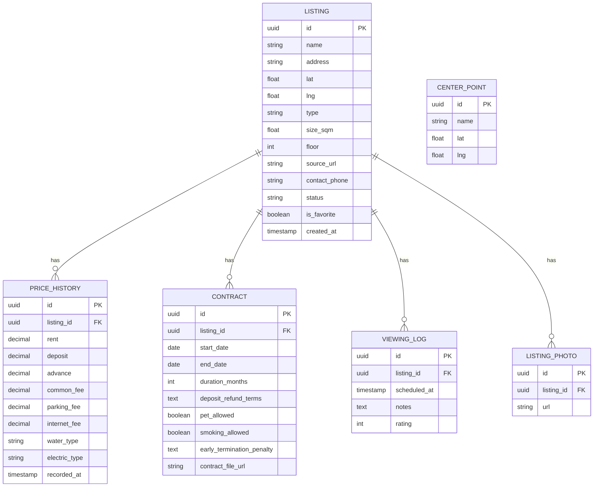

# Database Design: Condo/Apartment Hunting Tracker

## ER Diagram

## Entity Notes

### LISTING
Core table. One row per apartment/condo/room being tracked. Holds coordinates (`lat`/`lng`) for the map view (mapcn) and a `status` field for the pipeline (e.g. `interested`, `viewing_scheduled`, `viewed`, `negotiating`, `decided`, `rejected`).

### PRICE_HISTORY
Kept separate from `LISTING` so price changes (e.g. after negotiation) are logged over time instead of overwriting the original quoted price. One listing can have many price records, ordered by `recorded_at`.

### CONTRACT
Lease terms for a listing. Stored separately since not every listing will have a signed contract yet — only ones that progressed to that stage.

### VIEWING_LOG
Tracks scheduled/completed viewing appointments and notes/rating from each visit.

### LISTING_PHOTO
Multiple photos per listing, stored as a child table rather than an array column for easier querying/display in gallery or table view.

### CENTER_POINT
Independent table for reference locations (e.g. workplace, university, a landmark). Not foreign-keyed to `LISTING` — distance from each listing to each center point is computed on the fly from `lat`/`lng` at query time rather than stored, so no join table is needed.

## Relationships Summary
- `LISTING (1) → (N) PRICE_HISTORY`
- `LISTING (1) → (N) CONTRACT`
- `LISTING (1) → (N) VIEWING_LOG`
- `LISTING (1) → (N) LISTING_PHOTO`
- `CENTER_POINT` — standalone, referenced at query time for distance calculations, not via FK

## Suggested Cascade Rule
When a `LISTING` is deleted, cascade-delete its related `PRICE_HISTORY`, `CONTRACT`, `VIEWING_LOG`, and `LISTING_PHOTO` rows.
